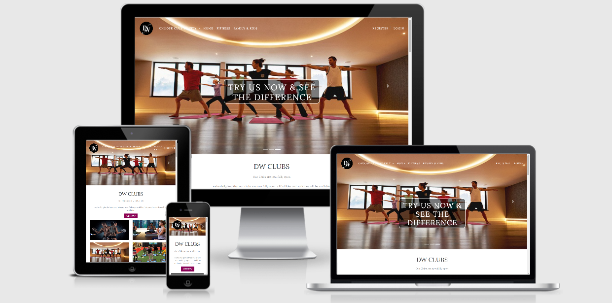

# DW: Clubs

___

The biggest core and the reason of this Club is to keep people health and to sport.

### Content
___

* UX
    1. Project Goals
        1. User Goals
        2. Site Owners Goals
        3. User Stories
    2. User Requirements and Expectations  
    3. Design Choices
        * Icons
        * Colors
        * Fonts
        * styling 
    4. Feature
        * Features that have been developed
        * Features that will be implemented in the future
    5. Technologies In the Project
        * Languages
        * Libraries & Framework
        * Tools
    6. Testing
    7. Deployment
    8. bugs

# UX(User Experience)
___

## Project Goals

The goal with the is to try make people work out atleast every after two days keeping the same exact routine when it comees to fitness.
A part from the fitness issue. The main project goal for this site is to increase peoples ___Awareness__ and make it user **friendly to the users**. 

### User Goals:

* Inspire users to try different workout programs and participate in classes
* Atleast the web site should be suitable for most of the gadgets ie, desktop,tablet and phones
* Making users to learn more and more **skills of gyming** 
* Helping people to be flexible in their definition of success.

### Site Owners Goals:
* To Inspire people Improve their **immune system**
* By increasing _Awareness_ to the site user.

### User Stories:
* As a user I want to have a separate field where i can eeasly talk more about my self _so that people can get to learn more of what I am doing._
* As a user i want to edit and  review content before it is published so that I can assure it is optimized with correct grammar and tone _Which makes the the project look professional_.
## User Requirements and Expectations:
___

### Requirements:
* The website has to be easly nevigated through Navbars and buttons respectely.
* The site must be displayed in visually manor.
* The site have **Specific inputs,** including __data types,__ to be entered into the system. 
### Expectations:

* The information should be **Accessible** and easly __understandable__.
* The site should be  Interactive.
* *Intuitiveness* of the site makes it perfect.

## Design Choices:
___

When designing this site, I trie to copy different ideas and layouts so that i could make mine in my own way. 
I wantend really to see if I can develop something different out of me. 
Therefore from the little skills I aquired from code Institute Instructors. So me making it wanted to see if it can compete on the international market.

### Fonts:
For this project I'm going to use the Serif and the [Lora](https://fonts.google.com/specimen/Lora?query=lora) however much there is a small difference, the two fonts work great together.

### Icons:
Icons are basically provided by [Font Awesome](https://fontawesome.com) and are **easly applied** to your website, used in __moderation__ and are self explanatory.

### Colors:
The colours that have used are mainly the colours that have chosen to let the web appearance look fantastic.
These are the colors i will be using in my entire websit.

#### color miture by names 
* Raisin Black:  `#1F1E22`
* Oxford Blue:  `#010830`
* Royal Blue Dark:  `#0C2E70`
* Fandago:  `#B93993`
* Red Pigment:  `#EC1212`
* White:  `#FEFEFE`

## Wireframes:
For my wireframing is i used apen Prototyping. I found this was really easy for me use. And it helped me to to whatr ever i wanted
and to see how it is on different screen sizes.

To be more clear of what i did, here are explanations about my **wireframes.**

##### Desktop Wireframe.
##### Tablet Wireframe.
##### Mobile Wireframe.

  
<strong>About My Site And Wireframes In Brief:</strong>

In the planing of this project I have created three different pages which are connected to diffrent Nav links, and these i made them to be internal links on one page respectively.
I made my wireframe with a pen style just normal drawing since it was my first time to land in these things of wireframe designing but still am trying my best to learn more (UI and UX) design.
In this wireframe planing of the project I made three big images as my welcome images but in carousel form sliding next to eachother and making my navbar link which makes the Navbar easily read on small device like a cell phone and so fouth. I created a carousel caption with white text and a transparent background which gave it a clear visibility and a nice layout.

My plan was to make different kind of landing pages but after a good talk with my mentor it was better
to make one page with multiple sections connected to different kind of links provided. I created the **Home**, **Clubs**, **What's Happening** and the **Family & Kids** pages.
I created my header where my navbar is, I gave my navbar a transparent background making it to be visible through the background with a white color to the navbar list and when you mouse hover the __Nav list they simply change to pink__ so the carousel images look pretty good with also the carousel-caption text.
This site consists of four pages connected to the nav links. I made all the nav links to be active and working, whenever they are clicked they dirrect you to different differentpart of the site.
The project is all about the gym. Helping people to remain fysically fit and health. That is the main core of it. 

## Features:
___
### Features that have been developed in my project:
* __I__ used __bootstrap__ on __navlinks__
* __Carousel__ for presenting three different kind of images
* __Navbar collapses__ on smaller screen sizes 

### Styling:
For my project am using bootstrap as my major styling foundation but still togather we the help of css and JQuery too.

## Technologies In the Project:
___

### Languages:
 * [HTML](https://html.com/)
 * [ CSS ](https://developer.mozilla.org/en-US/docs/Web/CSS)
 * [JS](https://developer.mozilla.org/en-US/docs/Web/JS)
 
 ### Libaries & Frameworks:
* [Bootstrap](https://getbootstrap.com/)
* [Font-Awesome](https://fontawesome.com/v4.7.0/)
* [JQuery](https://code.jquery.com/)
* [Googel fonts](https://fonts.google.com/)
* [Git](https://git-scm.com/)

## Testing:
___
It's very important to validate a project so that the site is responsive and really attractive to the user.
And i have also tried to check the spelling to see wheather what i wrote make sense. 
But i have also validated the code with __W3Schools CSS and HTML__ validator.

### Responsiveness
* __Implementation__ In this project i have used bootstrap to ensure maxmum  __Responsiveness__.
* __Responsiveness__ was as to be expected, except for the navbar, which did so collapse on click by following the teaching and reapeating them to get sure how to apply the JavaScript links which helps the toggle and the dropdown lists. I felt good that it worked.

### Design

* __Implementation__ The design of the project was just thought of and trying to impliment it in a real world,
was just trying to look on different kind of gym site and picking some different kind of pictures, but i had just used olny the pictures not less than that.
The project has got three parts but they are laid on one single page.
* __Results__  The font Lora brought out the lay out in a perfect way matching with the blue color and white for the navbar and the footer. At 
first i had made my navbar and footer with a background image blueblack gradient but later i changed to dark blue which is really good for the project.

### Header & Navbar:
* Plan: The header consis of a __navbar__ and is responsive.

* __Implementation__: I used  the different sections of the HTML page. The navbar is a Boostrap navbar. It will collapse the navlinks into an icon at smaller screensizes. I customized this for my likings ie my logo and other links on the navbar.
* __Test__: I test the responsivness of the header by opening the website in chrome and then resizing the window. I Also doublecheck in the chrome dev-tools, sometimes these two differs, the more correct one is the dev-tools one. I also doublechecked and looked at my website through my phone. I test to see if my navlinks works by clicking them. I use the dev-tools to see if my navlinks collapse into my chosen icon properly.
* __Results:__ The header work as intended. It is fully responsive on all screensizes. The navbar looks correct and the navlinks properly links to the different HTML-section linked. The navlinks correctly collapse into an icon at smaller sizes.
* __Verdict:__ It worked as i wanted and it has passed the test.

### Carousel Section:
* __Plan:__ **Use** some kind of slides images to represent different kind  of the gyms to go to. I made three different slide images with caption in the middle of each image. It should be fully responsive and attractive.
* **Implementation:** I used google to search for different kind of images to use . and with this I used bootstrap for my Carousel image making them to fit the whole screen with the help of some css to look responsive.
* __Results:__ My Carousel images worked well just as i like  maybe because i just copied the whole code as it was in bootstrap.
* __Verdict:__ The Carousel images passed all the test.

### Photos And Texts About The Site:
* **Plan:** I added a container-fluid in a navbar with Carousel image in the middle i had to put a Carousel caption with words about the gym. in pictures there
are people working out or something about the gym. And everything am gonna do will be about the gym.
* **Implementation:** I created a div container and within a div container i had create another div class carouselindicators within div carouselindicators i created 
a div class carousel-inner so I had to fix the three images within the carousel-inner to try make them my slide images.
The images i have used have found them on google just through searching for the better ones .
* **Test:** To see if everything works as intended I always use the chrome dev-tools to see what it would look like on different screen sizes.
* **Results:** Everything looks fine and works well as expected.
* __Verdict:__ The images & text about the project passed all the tests. 

### The Main Page:
* __Plan:__ To this main page i made it that it is clear for a viewer to easily acess the button for joining the club and some paragraphs which are meaningful about the site.
* __Implementation:__ I created a div section container and within the div i created more other four divs each giving it a photo and a paragraph of one word each, but all the images are about gym activities. 
In the styling of this i used bootstrap to design it out.
* __Test__ I had no issues with this section when i was testing it and i have also tried it with w3school validate and it passed it.
* __Results__ Everything worked well .
* __Verdict__ The images are working well as i wanted when i hover over mouse they zoom out and mouse out they zoom in.

### The Happening Page:
* __Plan:__ I created a div section container, within it I put another div column  then with in it I created an h2 giving it pt-4 as my heading for the section. I used bootstrap code to make the card images.  
Of which i added there two images and with some paragraphs. I got my images on google and my text i set it to the default color of the body and my headings are set to the dark.
* __Implementation:__ I created a div container and within that container i added a **column** and  the column is for __heading h2__ and the __paragraphs__, i created another column for the images, its the same thing i did for each image and paragraph.
* __Test:__ To see how the site works i always try to use the dev tool to see the resize of the web on different size screen.
* **Results:** Everything looks fine as it is  expected.
* __Verdict:__ The images & text about the gym passed all the tests.

### Club Fitness:

* **Plan:** I created a div class and i gave it a name hero-image ,in it i created a row and in it i added a column so that the image looks good for the image to fit the screen.
* __Implementation:__ This background image i used it to represent the fit of what people get when they join our club. I made it wide to fit the screen because this represent another page but i made it all on one page.
And also to bring out a clear image of what is really done at the club. I also added a text DW clubs Fitness to be overlayed by the image and i gave it an id so that when you go to the navbar and click , it just dirrect you to this page.
* __Test:__ It's looking just fine as i wanted after trying out my code in the dev-tool.
* **Results:** It is resizable just as i wanted.
* __Verdict:__ The div classes passed the test.

### Heading Club Fitness And Images:
* **Plan:** This page consists of the header h2 and it's embedded in its own div section, it also consists of three different images each represent different
kind of activity.
* __Implementation:__ When designing this part I used three different divs each card was wrapped in a div called fitness page but the styling was just the same because i gave them the same class name, making the stylish more easier.
 I created a div section container giving it a name container to wrap all the three divs, within a container i created a row ,and in the div row i created another div column, which i used to create the Responsiveness of the card and  how the card will  look like on different kind of devices.
 I gave the div column class for image medium 12 and large 6 and large 4 and also a class of hover when you mouse over the images of the paragraph the div column i gave them medium 12 and large 6 to all paragraphs.
* __Test:__ I tried it with the dev-tool and all worked fine.
* **Results:** It is resizable just as i wanted. 
* __Verdict:__ The div classes passed the test.

### Footer Section:
* **Plan:** I used the **footer** to holdsocial icons copyright text and headings and paragraphs.
*  __Implementation:__ *I created* **bootstrap footer**. I added a div row class and an id with a name footer-details, in this row i created sevral columns
with different headings and different paragraphs. I added __six font Awesome__ icons that links to different social media, I added  a subscription page which consist of email placeholder and a submition button. And also under the contacts in the footer there is a email address which dirrects you to it when clicked. 
lastly i added a copyright text to the footer.
* __Test__ To see everything works as intended i once again use the chrome dev-tools to see what would look like on different screen sizes.
* **Results:** __Everything__ looks and *works as expected*.
* __Verdict:__ The footer  passed all  the test.

### Responsiveness:
* **Plan:** I *Use Bootstrap* to make the website fully __responsive__ on all screen sizes.

* **Implementation:** I used the container, row and col approach to make the different sections of the *website responsive*. I also use the different col types to better be able to control how the content reacts to the different screen sizes.

* **Test:** To test this I mostly used chrome dev-tools. To check how the website would look in action. Things did not work as intended for me most times. I had a review with my code institute mentor and he gave me some tips and tricks on how to think. Once I went through the Bootstrap documentation again and see how it is.

* __Results:__ After a lot of testing and changing everything works as intended.

* __Verdict:__ The *responsiveness* passed all the tests.

## Bugs:

In **creating** of this site, i came across some **bugs**.
### Bootstrap carousel slide images displays not good.
* Bug: The slider and controls for the Bootstrap carousel images could not work properly.
* Solution: I used Google to find Css Tricks it's really the one which helped me. Once I added them everything worked perfectly.

### Bootstrap navbar 
* __Bug:__ When i added the navbar inside the container fluid it would display a lot of whitespace on the left and right ends.
* __Solution:__ There was no margin or padding to edit, setting is to negative margin did not work either. Luckily when I *added* the class "navalert-container" to the navbar and i gave it some css then the whitespace disapeared.
## Deployment:

The DW Gym was __created__ *and* **developed** using *GitHub* working together one in one with GitPod by using the git commonly used  commands, 
__git status, git commit and git push respectely to the gitHub__.

#### Github was used in deploying DW Club Gym by the following steps:

* __Opened__ up *GitHub* in the browser.
* __Signed__ in using *username and password*.
* __Selected__ my repositories.
* __Navigated__ to David-Gyavi/DW-Club.
* In the top navigation clicked settings.
* __Scrolled__ down to the __GitHub Pages area.__
* __Selected Master Branch__ from the Source *dropdown* menu.
* __Clicked__ to confirm my selection.
* **DW Club** is now live on *GitHub* Pages.

If you would want to *Clone* __DW Club__, follow the following steps.

* __Navigate__ to David-Gyavi/DW-Club.
* **Click** the **green** Clone or *Download* button.
* **Copy** the __url__ in the dropdown box.
* **Using** your __IDE__ of choice open up your preferred terminal or github desktop .
* __Navigate__ to your desired file location.
* **Copy** the following code and input it into your terminal to clone *David-Gyavi/DW-Club*.

Git clone https://github.com/David-Gyavi/DW-Clubs.git

## Credits:

### Pictures

**A**ll of these *pictures* used in this ****project** are free to use. I got these pictures  from **Google,** easily seached and found at any time.

### Special thanks to:

My code institute **mentor** [Simen Daehlin](https://github.com/Eventyret)
**This site is for educational purposes**