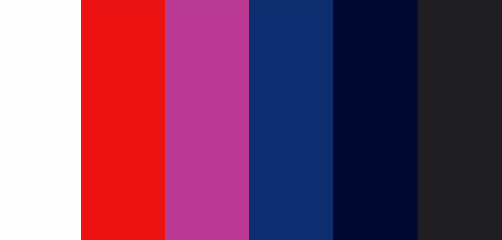

# DW: Clubs

___

The biggest core and the reason of this Club is to keep people health and to sport.

### Content
___

* UX
    1. Project Goals
        1. User Goals
        2. Site Owners Goals
        3. User Stories
    2. User Requirements and Expectations  
    3. Design Choices
        * Icons
        * Colors
        * Fonts
        * styling 
    4. Feature
        * Features that have been developed
        * Features that will be implemented in the future
    5. Technologies In the Project
        * Languages
        * Libraries & Framework
        * Tools
    6. Testing
    7. Deployment
    8. bugs

# UX(User Experience)
___

## Project Goals

The goal with the is to try make people work out atleast every after two days keeping the same exact routine when it comees to fitness.
A part from the fitness issue. The main project goal for this site is to increase peoples ___Awareness__ and make it user **friendly to the users**. 

### User Goals:

* Inspire users to try different workout programs and participate in classes
* Atleast the web site should be suitable for most of the gadgets ie, desktop,tablet and phones
* Making users to learn more and more **skills of gyming** 
* Helping people to be flexible in their definition of success.

### Site Owners Goals:
* To Inspire people Improve their **immune system**
* By increasing _Awareness_ to the site user.

### User Stories:
* As a usre I need to review my previous bids in the Acquisition ordering platform so that _I can remove expired bids._
* As a user i want to edit and  review content before it is published so that I can assure it is optimized with correct grammar and tone.
## User Requirements and Expectations:
___

### Requirements:
* The website has to be easly nevigated through Navbars and buttons respectely
* The must be displayed in visually manor.
* The site have **Specific inputs,** including __data types,__ to be entered into the system. 
### Expectations:

* The information should be **Accessible** and easly __understandable__.
* The site should be  Interactive.
* *Intuitiveness* of the site makes it perfect.

## Design Choices:
___

When designing this site, I trie to copy different ideas and layouts so that i could make mine in my own way. 
I wantend really to see if i can develop something different out of me. 
Therefore from the little skills i aquired from code Institute Instructors. So me making it wanted to see if it can compete on the international market.

### Fonts:
For this project I'm going to use the Serif and the [Lora](https://fonts.google.com/specimen/Lora?query=lora) however much there is a small difference, the two fonts work great together.

### Icons:
Icons are basically provided by [Font Awesome](https://fontawesome.com) and are **easly applied** to your website, used in __moderation__ and are self explanatory.

### Colors:
The colours that have used are mainly the colours that have chosen to let the web appearance look fantastic.
These are the colors i will be using in my entire websit.

#### color miture by names 
* Raisin Black:  `#1F1E22`
* Oxford Blue:  `#010830`
* Royal Blue Dark:  `#0C2E70`
* Fandago:  `#B93993`
* Red Pigment:  `#EC1212`
* White:  `#FEFEFE`

### Styling:
For my project am using bootstrap as my major styling foundation but still togather we the help of css and JQuery too.

## Technologies In the Project:
___

### Languages:
 * [HTML](https://html.com/)
 * [ CSS ](https://developer.mozilla.org/en-US/docs/Web/CSS)
 * [JS](https://developer.mozilla.org/en-US/docs/Web/JS)
 
 ### Libaries & Frameworks:
* [Bootstrap](https://getbootstrap.com/)
* [Font-Awesome](https://fontawesome.com/v4.7.0/)
* [JQuery](https://code.jquery.com/)
* [Googel fonts](https://fonts.google.com/)
* [Git](https://git-scm.com/)

## Testing:
___
